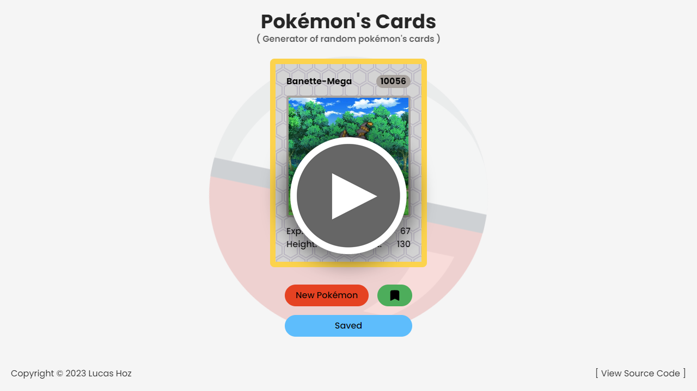

<h1 align="center">
    Pokémon's Cards
</h1>

<h4 align="center">
    Repository of an app which generate random Pokémon's cards.
</h4>

    <a href="#----summary">Summary</a> •
    <a href="#----key-features">Key Features</a> •
    <a href="#----installation">Installation</a> •
    <a href="#----available-scripts">Available Scripts</a> •
    <a href="#----related">Related</a> •
    <a href="#----license">License</a> •
    <a href="#----contact">Contact</a>

    

    <strong>(watch a <a href="https://pokemon-cards-ochre.vercel.app/" target="_blank">live test</a> or a <a href="https://www.youtube.com/watch?v=w4GR0nch1cg" target="_blank">video preview</a>)</strong>

<h2>
    Summary
</h2>

    This is a project where you can generate random pokémons cards made with <a href="https://vitejs.dev/" target="_blank">Vite</a>, <a href="https://reactjs.org/" target="_blank">React</a>, <a href="https://www.typescriptlang.org/" target="_blank">TypeScript</a>, and <a href="https://tailwindcss.com/" target="_blank">Tailwind CSS</a>. You can save these cards in your local storage. I used npm packages like: <a href="https://eslint.org/" target="_blank">ESLint</a>, <a href="https://prettier.io/" target="_blank">Prettier</a>, <a href="https://github.com/typicode/husky" target="_blank">Husky</a>, and others to make my code be more 'prettier'.

<h2>
    Key Features
</h2>

    <ul>
        <li>
            Hooks
        </li>
        <li>
            API Fetch
        </li>
        <li>
            React Router
        </li>
        <li>
            Local Storage
        </li>
        <li>
            Live Notifications
        </li>
        <li>
            State Management
        </li>
        <li>
            Responsive Design
        </li>
    </ul>

<h2>
    Installation
</h2>

    Clone the repository, install <a href="https://nodejs.org/es/" target="_blank">Node.js</a> (runtime environment) and use <a href="https://code.visualstudio.com/" target="_blank">Visual Studio Code</a> (code editor). Then run command <code>npm install</code> to install all packages, necessary for a Vite app with React, and run command <code>npm run dev</code>. Done, now you can see it in a development server.

<h2>
    Available Scripts
</h2>

    <ul>
        <li>
            <code>npm run dev</code>: Runs the app in the development mode. Open <a href="http://localhost:5173" target="_blank">http://localhost:5173</a> to view it in your browser. The page will reload when you make changes. You may also see any lint errors in the console.
        </li>
    </ul>

<h2>
    Related
</h2>

    <ul>    
        <li>
            <a href="https://github.com/hozlucas28/Codo-Codo-React-Project-02-2023" target="_blank">Repository of a to-do lists project</a>
        </li>
        <li>
            <a href="https://github.com/hozlucas28/React-Image-Search-Practice-2023" target="_blank">Repository of an image search project</a>
        </li>
        <li>
            <a href="https://github.com/hozlucas28/React-Interest-Calculator-Practice-2023" target="_blank">Repository of an interest calculator project</a>
        </li>
        <li>
            <a href="https://github.com/hozlucas28/Codo-Codo-React-Project-01-2023" target="_blank">Repository of rock, paper, and scissors project</a>
        </li>
        <li>
            <a href="https://github.com/hozlucas28/Codo-Codo-Front-end-Project-2022" target="_blank">Repository of 'Codo a Codo' Front-end project</a>
        </li>
        <li>
            <a href="https://github.com/hozlucas28/Codo-Codo-Back-end-Project-2022" target="_blank">Repository of 'Codo a Codo' Back-end project</a>
        </li>
    </ul>

<h2>
    License
</h2>

    This repository is under <a href="./LICENSE" target="_blank">MIT License</a>, if you want to see what you are allowed to do with the content of this repository, please visit <a href="https://choosealicense.com/licenses/" target="_blank">choosealicense</a> for more information.

<h2>
    Contact
</h1>

    If you want to contact me, please see my <a href="https://github.com/hozlucas28" target="_blank">socials medias</a> in my GitHub profile.

